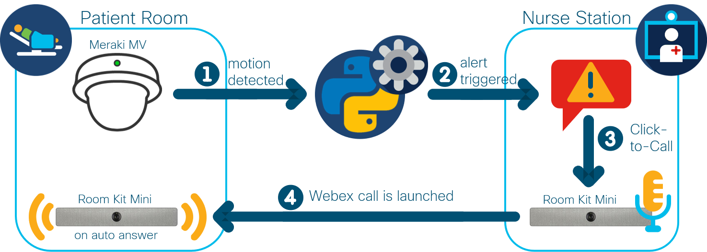
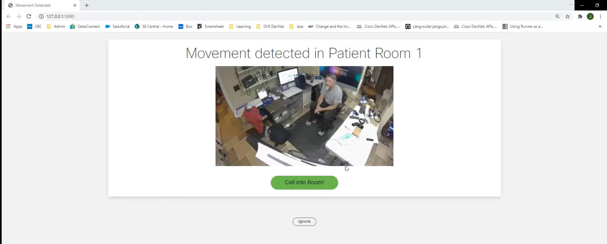

# Remote Patient Monitoring

An application utilizing Meraki MV cameras and Webex RoomKit Minis to monitor and communicate with patients remotely. If movement is detected in a patient's room, an alert is triggered at the nurse's monitoring station. The nurse can then click to call into the patient's room to talk to him/her  directly ([watch demo](https://youtu.be/5ocICXXz3c0)).

## Overview
 

**Meraki MV Camera**: The [Meraki MV cameras](https://meraki.cisco.com/products/smart-cameras/) provide reliable security and valuable insights to organizations while being simple to deploy, configure, and manage. With its [APIs](https://developer.cisco.com/meraki/mv-sense/#!overview/introduction), the camera becomes a sensor and we can have smart cameras that can learn and provide more insights over time, that better understand people behavior patterns, and that provide context or trigger action in other systems. For this use case, we are using the [MQTT](https://developer.cisco.com/meraki/mv-sense/#!mqtt/what-is-mqtt) protocol to get notified when a MV Camera detects motion in the [camera's zone field](https://developer.cisco.com/meraki/mv-sense/#!zones). A snapshot of the room is included in the notification sent to the nurse's station using the [MV Sense REST API](https://developer.cisco.com/meraki/mv-sense/#!rest-api).

**Webex RoomKit Mini**: The [Webex Room Kit Mini](https://www.cisco.com/c/en/us/products/collaboration-endpoints/webex-room-kit-mini/index.html) is an AI-powered video conferencing system that is easy to use, deploy, and manage. It combines codec, camera, microphones, and speakers into a single device that integrates with a 4K display to bring more intelligence and usability. Through the [Webex Developer Platform](https://developer.webex.com/docs/platform-introduction), it is simple to integrate the Webex device into applications. For this use case, we are using [Webex Widgets](https://developer.webex.com/docs/widgets) to embed Webex Teams functionality directly into the notification sent to the nurse station to enable a simple and quick click-to-call functionality.

**Notification Screenshot**:

## Contacts
* Jara Osterfeld (josterfe@cisco.com)

## Solution Components
* Meraki MV Cameras, incl. MV Sense MQTT and REST API
* Webex Room Kit Mini
* Webex Widgets
* Python
* Flask
* Javascript

## Prerequisites
- **Meraki MV Cameras**: 
   - **MQTT Broker**: To configure the MQTT broker in the Meraki dashboard, follow [these steps](https://developer.cisco.com/meraki/mv-sense/#!mqtt/configuring-mqtt-in-the-dashboard). For testing, you can use a public broker (see examples [here](https://github.com/mqtt/mqtt.github.io/wiki/public_brokers)). Note down the MQTT broker IP address or domain name and the port. 
   - **Important Note on Number of Cameras/Rooms**: This use case was prototyped with access to only one camera. Some changes therefore need to be made when there are more rooms and cameras the MQTT broker listens to. This includes iterating over the rooms when multiple are listed in the `MerakiCameras_to_WebexRoomKitMini_Pairing.csv` (compare for example to lines 34 to 37 and line 44 in `main.py` and lines 37 to 41 and line 49 in `web_app.py`) to ensure the right room information, Webex SIP address and snapshot are included in the popup notification windows. As for the MQTT broker, you can have a look at [this use case](https://github.com/CiscoDevNet/Meraki-Camera-Notification).  
   - **MV Sense REST APIs**: You need to enable API access in the Meraki dashboard following [these steps](https://developer.cisco.com/meraki/mv-sense/#!rest-api/enable-api). Generate an API key as described in the instructions and note it down.
   - **Camera Setup**:
     - **Dashboard registration, serial numbers, and network ID**: The camera needs to be registered in your Meraki dashboard. You can find a setup guide [here](https://documentation.meraki.com/MV/MV_Quick_Start). You will also need the serial number of the camera and the network ID in which they are registered. You can retrieve it using this [API call](https://developer.cisco.com/meraki/api/#!get-organization-networks).
     - **Zone ID**: Zones are a useful tool to identify specific areas of interest in the camera’s field of view. For this use case, you can for example define zones to only focus on the beds in the patient's rooms. Zones can be configured in the dashboard following [these steps](https://developer.cisco.com/meraki/mv-sense/#!zones/configuring-zones-in-the-dashboard) and then queried by MV Sense APIs by its ID, which can be retrieved using this [API call](https://developer.cisco.com/meraki/mv-sense/#!rest-api/zones). Note down the zone ID together with the camera serial number. If no zone is configured/required, use zone ID 0.
   - **Motion Detection Sensitivity Levels**: How quickly a notification is sent to the nurse's station after a patient has moved can be customized. This is implemented based on [this use case](https://github.com/CiscoDevNet/Meraki-Camera-Notification). The values to do so can be manipulated in the `main.py` file through the following variables:
     - *MOTION_ALERT_PEOPLE_COUNT_THRESHOLD*: defines how many people need to be in the picture/zone for the camera to go into detection mode
     - *MOTION_ALERT_ITERATE_COUNT*: defines after how many messages sent to the MQTT broker a notification is triggered, the lower the value the faster a notification is triggered
     - *MOTION_ALERT_TRIGGER_PEOPLE_COUNT*: control value for people threshold after iteration count
     - *MOTION_ALERT_PAUSE_TIME*: the time in seconds counted after an alert is triggered before another alert can be triggered
 

- **Webex Room Kit Mini**: 
   - **Webex Cloud Registration**: Register your Webex Device in the cloud following [these steps](https://help.webex.com/en-us/n25jyr8/Register-a-Device-to-Cisco-Webex-Using-API-or-Local-Web-Interface). 
   - **Enabling Auto-Answer**: For the nurse to be able to directly call into the patients' rooms, the Webex RoomKit Minis have to pick up calls automatically. To allow this, the device's Conference AutoAnswer Mode needs to be turned on. You can find instructions on how to do this in the [admin guide](https://www.cisco.com/c/en/us/support/collaboration-endpoints/spark-room-kit-series/products-maintenance-guides-list.html) of the devices.
   - **Webex Widgets and Access Tokens**: For the widget to be able to make calls from the nurse station, you need to provide a Webex access token to authorize. In this use case, we are using a personal access token that you can get [here](https://developer.webex.com/docs/api/getting-started#accounts-and-authentication) for any user and copy it into the `credentials.yml` file. This access token only has a lifetime of 12 hours and is hard coded into the prototype. To retrieve access tokens through an OAuth authorization grant flow and thereby grant permission to Webex Teams users to your app more dynamically, see the [Integrations Guide](https://developer.webex.com/docs/integrations) and an example of how it is used in an application flow [here](https://github.com/gve-sw/O365_WebexMeeting_WebScheduler).
   - **Device ID and SIP address**: Retrieve the device IDs and SIP addresses of each Webex RoomKit device. You can get the information using [the List Devices API call](https://developer.webex.com/docs/api/v1/devices/list-devices) for the device ID and [the Get Device Details API call](https://developer.webex.com/docs/api/v1/devices/get-device-details) to get the devices' SIP addresses.

## Installation

1. Clone this repository with `git clone <this repo>` and open the directory of the root repository.

2. Open the **`credentials.yml`** file, and with the information collected in the [Prerequisites section](##Prerequisites), fill in the values for the variables listed in the file. These include the `WT_ADMIN_TOKEN`, `MERAKI_KEY`, `MERAKI_NETWORK_ID`, `MQTT_SERVER`, and `MQTT_PORT`.

3. Open the **`MerakiCameras_to_WebexRoomKitMini_Pairing.csv`** file, and with the information collected in the [Prerequisites section](##Prerequisites), fill in the information of the Meraki cameras and Webex RoomKit Mini devices that are located in each patient room. For each room, use a new line in the following sequence: `Room_Name,Meraki_SN,Meraki_Zone_ID,Webex_RoomKitMini_ID,Webex_RoomKitMini_SIP`

4. Open a terminal and navigate to the root of the repository.

5. (Optional) Create a Python virtual environment and activate it (find instructions [here](https://docs.python.org/3/tutorial/venv.html)).

6. Navigate to the root directory of the repository, and install the requirements with `pip install -r requirements.txt`.

7. Set the following environment variable: `set FLASK_APP=web_app.py`.

8. Start the Flask app for the notification application with `flask run -p 5000`.

9. Open a second terminal and if applicable, activate the same virtual environment. 

10. Again, navigate to the root directory of the repository, and run the MQTT application with `python main.py`.

## License
Provided under Cisco Sample Code License, for details see [LICENSE](LICENSE.md).

## Code of Conduct
Our code of conduct is available [here](./CODE_OF_CONDUCT.md).

## Contributing
See our contributing guidelines [here](./CONTRIBUTING.md).